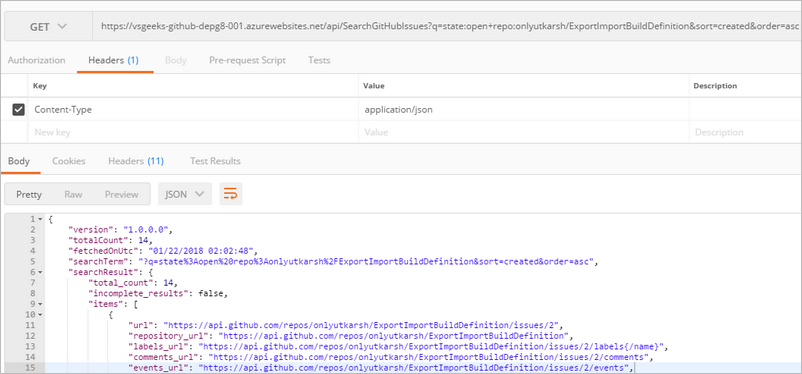
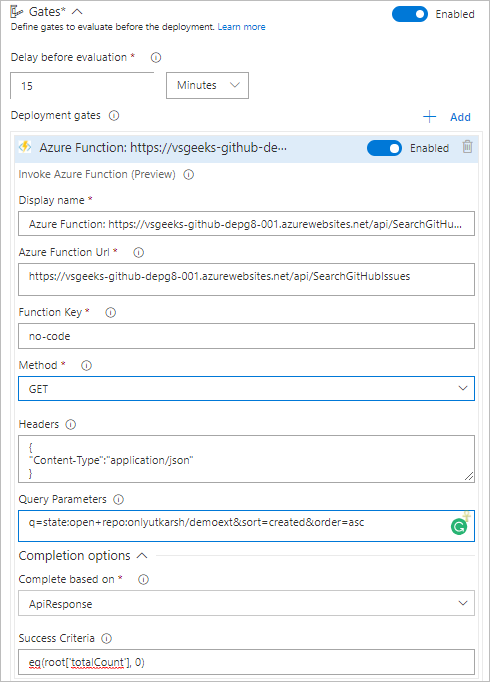
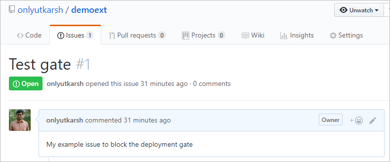
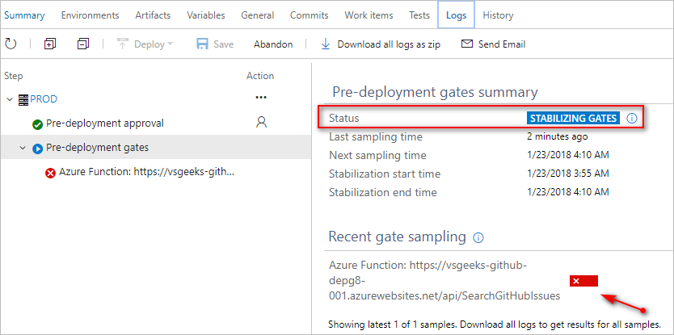
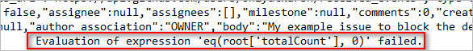
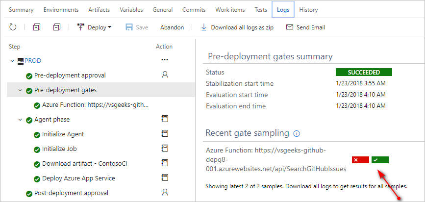

In this blog post, we will see yet another scenario of using powerful VSTS's deployment gates functionality. This time we will see how we can leverage this functionality to check for any issues (based on your search query) in your GitHub repo and wait for deployment if any issues exist.
<!--more-->

## GitHub Issues API  ##

GitHub API allows us to search [many things](https://developer.github.com/v3/search/). But because our goal is to wait for deployment if we have any open issues in our repository, we will be using [search issues API](https://developer.github.com/v3/search/#search-issues).

GitHub also has a very powerful search qualifiers which allow you to fine grain your search and get you the exact results. You can read more about search qualifiers [here](https://help.github.com/articles/searching-issues-and-pull-requests/).

To illustrate, say I would like to search open issues in my [Export/Import Build definition extension repository](https://github.com/onlyutkarsh/ExportImportBuildDefinition). So I can use a search query like below.

```
https://api.github.com/search/issues?q=state:open+repo:onlyutkarsh/ExportImportBuildDefinition&sort=created&order=asc
```

## Azure Function to search GitHub issues ##

As Tarun showed in his previous [blog post](https://www.visualstudiogeeks.com/DevOps/IntegratingServiceNowWithVstsReleaseManagementUsingDeploymentGate), VSTS deployment gate has native support for Azure functions. 

I have created an Azure function which takes a search query as per [GitHub issues API](https://developer.github.com/v3/search/#search-issues) and then returns the results back to JSON. I have already built the Azure function and we can execute the above search query with URL below. 

Notice, With the query below, I am searching for open issues under my demo repo `demoext`.

```
https://vsgeeks-github-depg8-001.azurewebsites.net/api/SearchGitHubIssues?q=state:open+repo:onlyutkarsh/demoext&sort=created&order=asc
```

A sample output for our search query shown above will look like this.



## Integrating Azure function into VSTS as a Deployment Gate ##

Now that our Azure function to search GitHub repo for issues is hosted, let's configure pre-deployment gate for our demo release definition. I go to "Gates" section and select "Azure Function" and configure as below.



Please **note** that I am using completion option as API response and checking if `totalCount` of issues in the returned JSON is equal to zero with the below expression.

```
eq(root['totalCount'], 0)
```


## Evaluating GitHub issues ##

At this moment we have an issue open in my GitHub repo.



Once configured your deployment gate correctly, as shown above, VSTS will periodically (as defined in the sampling interval) checks the response from the Azure function against defined expression to see if it evaluates to true. 

Sampling result is shown in the 'Recent gate sampling` section as shown below.



 You can download the logs to see the full results of the deployment gates, including API calls and the results back from the API.



Finally, once you mark your all issues (based on your search query) as closed, VSTS will proceed with the deployment. And once the release succeeds, you will see the summary like below.



Notice, `Recent gate sampling` section is showing us that our second sampling evaluated the expression to true. Hence the deployment went ahead and successfully deployed our application.

## Use our Azure function to search GitHub repo for free ##

Excited and want to use our ready to consume function into your release pipeline? Go ahead and use it.

Function URL: `https://vsgeeks-github-depg8-001.azurewebsites.net/api/SearchGitHubIssues`

Just ensure that your search query is as per [GitHub issues API](https://developer.github.com/v3/search/#search-issues).

## Summary ##

VSTS Release Management's deployment gate is a powerful feature, which enables you to seamlessly integrate third-party systems with your release pipeline. We have already many examples like pausing your deployment based on twitter sentiment [more here](https://blogs.msdn.microsoft.com/bharry/2017/12/15/twitter-sentiment-as-a-release-gate/) and Service now integration in your release pipeline in a [post](https://www.visualstudiogeeks.com/DevOps/IntegratingServiceNowWithVstsReleaseManagementUsingDeploymentGate) from Tarun. In this blog post we saw an additional scenario of pausing your deployment while you wait on issues to be closed in your GitHub repo. Let me know your thoughts/suggestions.
